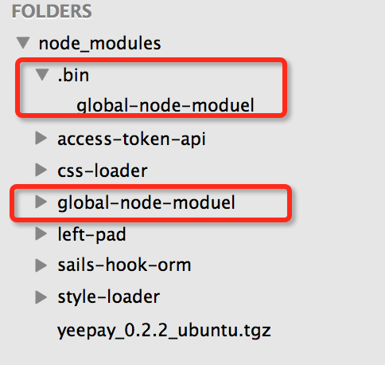
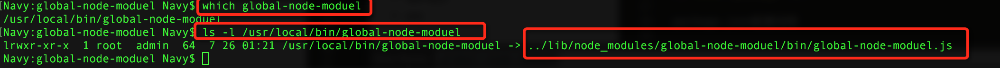

# global-node-moduel

## usage

in code:

```js
var GNM = require('global-node-moduel');
GNM.copySync('fixtures/test.txt', 'fixtures/test_copy.txt');
```

in command line:

```js
global-node-moduel -c fixtures/test.txt -o fixtures/test_copy.txt
```

## 如何编写一个全局的Nodejs模块，只需两步。

### 第一步：package.json文件添加key:bin

```js
"bin": {
  "global-node-moduel": "./bin/global-node-moduel.js"
}
```
上面的意思是，添加全局命令行执行命令：`global-node-moduel`，并且运行的node脚本文件是：`./bin/global-node-moduel.js`。[关于package.json 配置的说明，请看这里。](#package)

### 第二步：编写bin脚本（即本例子`bin/global-node-moduel.js`）

```js
#!/usr/bin/env node

var program = require('commander');
var pkg = require('../package.json');
var GM = require('../index');
var chalk = require('chalk');
var path = require('path');
program.version(pkg.version)
    .option('-c, --copy [path]', 'copy file sync')
    .option('-o, --output [path]', 'output file path')
    .option('-r, --remove [path]', 'remove file sync')
    .parse(process.argv);

init();
function init() {
    var copyPath = program.copy;
    var outputPath = program.output;
    var removePath = program.remove;
    var GMI = new GM();
    if (copyPath) {
        if (outputPath) {
            try{
                GMI.copySync(copyPath, outputPath);
                console.log(chalk.green.bold('copy file from ', path.resolve(copyPath), ' to ', path.resolve(outputPath)));
            } catch(e) {
                console.log(chalk.red.bold('[copySync ERROR]: '+ e.message));
            }
        } else {
            console.log(chalk.yellow.bold('[miss param output]'));
        }
        return; 
    } else if (removePath) {
        try{
            GMI.removeSync(removePath);
            console.log(chalk.green.bold('remove file from ', path.resolve(removePath)));
        } catch(e) {
            console.log(chalk.red.bold('[removeSync ERROR]: '+ e.message));
        }
        return;
    } else {
        console.log(chalk.blue.bold('[version]: ') + pkg.version);
        program.help();
    }
}
```

第一行`#!/usr/bin/env node`指该文件使用node脚本来执行（linux同学会很熟悉）。例子中主要引用`commander`模块，用来处理命令行的参数。[关于commander的API请看这里](#commander)


经过上面两个步骤，我们的全局可安装的Nodejs模块就编写完成了，下面会讲局部安装和全局安装的区别。


## 模块安装

- 局部安装

  ```
  npm install global-node-moduel
  ```
  安装完成后会在当前`node_modules`目录下有一个`.bin`目录，`.bin`目录下有一个文件是`global-node-moduel`。看下图：

  

- 全局安装

  ```
  npm install -g global-node-moduel //可能需要sudo权限
  ```
  安装完成后，我们可以通过`which global-node-moduel`命令查看安装的位置，假如是`/usr/local/bin/global-node-moduel`，然后再通过命令`ls -l /usr/local/bin/global-node-moduel` 查看可执行命令文件的真实位置：`lrwxr-xr-x  1 root  admin  64  7 26 01:21 /usr/local/bin/global-node-moduel -> ../lib/node_modules/global-node-moduel/bin/global-node-moduel.js` ，也就是后面的 `../lib/node_modules/global-node-moduel/bin/global-node-moduel.js`。由此看看出，全局安装的模块会在`/usr/local/bin/`目录（不同系统目录可能不一样，但原理是一样的）下创建一个软件，链接到`bin`的同层目录`lib/node_modules/global-node-moduel/bin/global-node-moduel.js`，也就是说实际上全局安装的模块是位于目录`/usr/local/lib/node_modules/`下（不同系统目录可能不一样）。看下图：

  

<a name="package" />

[package.json配置说明](https://github.com/ericdum/mujiang.info/issues/6/)

<a name="commander" />

[commander API 文档说明](http://blog.fens.me/nodejs-commander/)


关于命令行开发，可参考[Node.js 命令行程序开发教程](http://www.ruanyifeng.com/blog/2015/05/command-line-with-node.html)